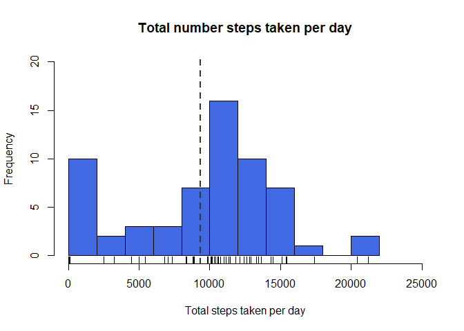
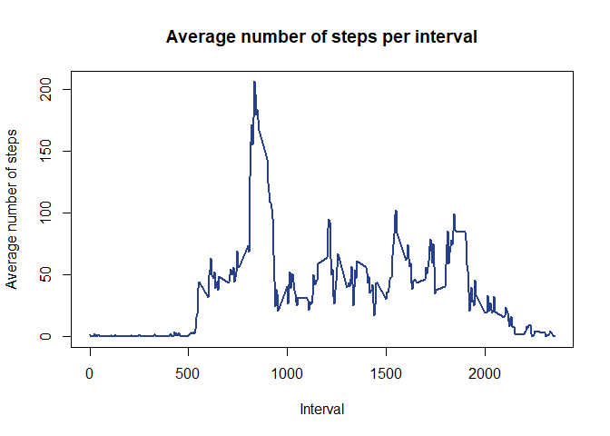
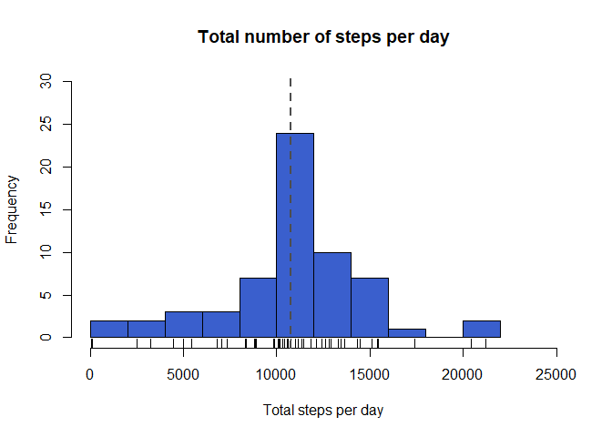
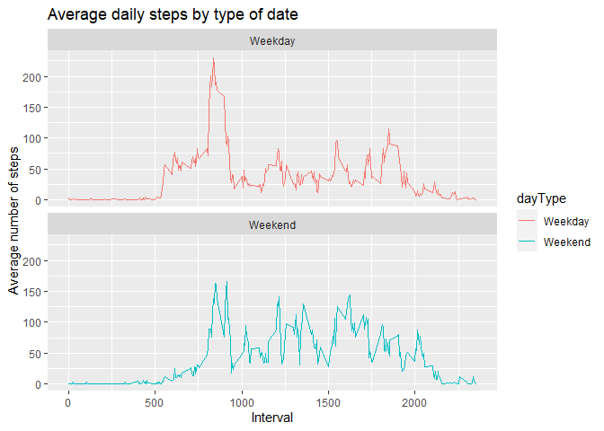

# **Introduction**

It is now possible to collect a large amount of data about personal movement using activity monitoring devices such as a [Fitbit](https://www.fitbit.com/co/home), [Nike Fuelband](https://www.nike.com/help/a/why-cant-i-sync), or [Jawbone Up](https://www.jawbone.com/). These type of devices are part of the “quantified self” movement – a group of enthusiasts who take measurements about themselves regularly to improve their health, to find patterns in their behavior, or because they are tech geeks. But these data remain under-utilized both because the raw data are hard to obtain and there is a lack of statistical methods and software for processing and interpreting the data.

This assignment makes use of data from a personal activity monitoring device. This device collects data at 5 minute intervals through out the day. The data consists of two months of data from an anonymous individual collected during the months of October and November, 2012 and include the number of steps taken in 5 minute intervals each day.


## Loading and preprocessing the data

First, is necessary load the data.


```r
URL <- "https://d396qusza40orc.cloudfront.net/repdata%2Fdata%2Factivity.zip"
if(!file.exists("getdata-projectfiles-UCI HAR Dataset.zip")){
    temp <- tempfile()
    download.file(URL, temp, method = "curl")
    unzip(temp)
    unlink(temp)
}
activity<-read.csv("activity.csv")
```

Verify the database with a descriptive functions

```r
head(activity, 3)
```

```
##   steps       date interval
## 1    NA 2012-10-01        0
## 2    NA 2012-10-01        5
## 3    NA 2012-10-01       10
```

```r
dim(activity)
```

```
## [1] 17568     3
```

```r
str(activity)
```

```
## 'data.frame':	17568 obs. of  3 variables:
##  $ steps   : int  NA NA NA NA NA NA NA NA NA NA ...
##  $ date    : chr  "2012-10-01" "2012-10-01" "2012-10-01" "2012-10-01" ...
##  $ interval: int  0 5 10 15 20 25 30 35 40 45 ...
```

```r
summary(activity)
```

```
##      steps            date              interval     
##  Min.   :  0.00   Length:17568       Min.   :   0.0  
##  1st Qu.:  0.00   Class :character   1st Qu.: 588.8  
##  Median :  0.00   Mode  :character   Median :1177.5  
##  Mean   : 37.38                      Mean   :1177.5  
##  3rd Qu.: 12.00                      3rd Qu.:1766.2  
##  Max.   :806.00                      Max.   :2355.0  
##  NA's   :2304
```

The database contain 17568 observations of three variables

## What is mean total number of steps taken per day?

The total number of steps taken per day acording to the data is


```r
total_steps <- with(activity, aggregate(steps, by = list(date), FUN = sum, na.rm = TRUE))
names(total_steps) <- c("date", "steps")
hist(total_steps$steps, main = "Total number steps taken per day", col = "royalblue", xlab = "Total steps taken per day", nclass = 8, xlim = c(0, 25000), ylim = c(0, 20))
rug(total_steps$steps)
abline(v = mean(total_steps$steps), lwd = 2, lty = 2, col = "gray20")
```

<!-- -->

```r
mean_steps <- round(mean(total_steps$steps), 2)
median_steps <- median(total_steps$steps)
```

The mean of the total number od steps taken per day is 9354.23 (the vertical line in the histogram) and the median is 10395

The mean and median steps per day view in the next tables

```r
meanday <- tapply(total_steps$steps, total_steps$date, mean)
medianday <- tapply(total_steps$steps, total_steps$date, median)
all.equal(medianday, meanday)
```

```
## [1] TRUE
```

And see the mean and median per day are the same.

## What is the average daily activity pattern?

- Make a time series plot (i.e. type = “l”) of the 5-minute interval (x-axis) and the average number of steps taken, averaged across all days (y-axis)


```r
average_activity <- aggregate(activity$steps, by = list(activity$interval), mean, na.rm = TRUE)
names(average_activity) <- c("interval", "mean")
interval_mean <- average_activity[which.max(average_activity$mean), ]$interval
with(average_activity, plot(interval, mean, type = "l", col = "royalblue4", lwd = 2, main = "Average number of steps per interval", xlab = "Interval", ylab = "Average number of steps"))
```

<!-- -->

- Which 5-minute interval, on average across all the days in the dataset, contains the maximum number of steps?

The maximum number of steps in 5-minute interval is 835

## Imputing missing values

There are a number of days/intervals where there are missing values (coded as NA). The presence of missing days may introduce bias into some calculations or summaries of the data.

Calculate and report the total number of missing values in the dataset (i.e. the total number of rows with NAs)


```r
numNA <- sum(is.na(activity$steps))
```

The total number of _NAs_ is 2304

Devise a strategy for filling in all of the missing values in the dataset. The strategy does not need to be sophisticated. For example, you could use the mean/median for that day, or the mean for that 5-minute interval, etc.


```r
impute <- average_activity$mean[match(activity$interval, average_activity$interval)]
activity_impute <- transform(activity, steps = ifelse(is.na(activity$steps), impute, activity$steps))
total_imputed <- aggregate(steps ~ date, data = activity_impute, sum)
names(total_imputed) <- c("date", "daily_steps")
total_mean <- mean(total_imputed$daily_steps)
total_median <- median(total_imputed$daily_steps)
```

Make a histogram of the total number of steps taken each day and Calculate and report the mean and median total number of steps taken per day. Do these values differ from the estimates from the first part of the assignment? What is the impact of imputing missing data on the estimates of the total daily number of steps?


```r
hist(total_imputed$daily_steps, main = "Total number of steps per day", xlab = "Total steps per day", nclass = 10, xlim = c(0,25000), ylim = c(0, 30), col = "royalblue3")
rug(total_imputed$daily_steps)
abline(v = total_mean, lwd = 2, lty = 2, col = "gray30")
```

<!-- -->

The mean of the total number od steps taken per day with imputed missing values is 1.0766189\times 10^{4} (the vertical line in the histogram) and the median is 1.0766189\times 10^{4}

The mean and median steps per day view in the next tables

```r
total_meanday <- tapply(total_imputed$daily_steps, total_imputed$date, mean)
total_medianday <- tapply(total_imputed$daily_steps, total_imputed$date, median)
total_meanday; total_medianday
```

```
## 2012-10-01 2012-10-02 2012-10-03 2012-10-04 2012-10-05 2012-10-06 2012-10-07 
##   10766.19     126.00   11352.00   12116.00   13294.00   15420.00   11015.00 
## 2012-10-08 2012-10-09 2012-10-10 2012-10-11 2012-10-12 2012-10-13 2012-10-14 
##   10766.19   12811.00    9900.00   10304.00   17382.00   12426.00   15098.00 
## 2012-10-15 2012-10-16 2012-10-17 2012-10-18 2012-10-19 2012-10-20 2012-10-21 
##   10139.00   15084.00   13452.00   10056.00   11829.00   10395.00    8821.00 
## 2012-10-22 2012-10-23 2012-10-24 2012-10-25 2012-10-26 2012-10-27 2012-10-28 
##   13460.00    8918.00    8355.00    2492.00    6778.00   10119.00   11458.00 
## 2012-10-29 2012-10-30 2012-10-31 2012-11-01 2012-11-02 2012-11-03 2012-11-04 
##    5018.00    9819.00   15414.00   10766.19   10600.00   10571.00   10766.19 
## 2012-11-05 2012-11-06 2012-11-07 2012-11-08 2012-11-09 2012-11-10 2012-11-11 
##   10439.00    8334.00   12883.00    3219.00   10766.19   10766.19   12608.00 
## 2012-11-12 2012-11-13 2012-11-14 2012-11-15 2012-11-16 2012-11-17 2012-11-18 
##   10765.00    7336.00   10766.19      41.00    5441.00   14339.00   15110.00 
## 2012-11-19 2012-11-20 2012-11-21 2012-11-22 2012-11-23 2012-11-24 2012-11-25 
##    8841.00    4472.00   12787.00   20427.00   21194.00   14478.00   11834.00 
## 2012-11-26 2012-11-27 2012-11-28 2012-11-29 2012-11-30 
##   11162.00   13646.00   10183.00    7047.00   10766.19
```

```
## 2012-10-01 2012-10-02 2012-10-03 2012-10-04 2012-10-05 2012-10-06 2012-10-07 
##   10766.19     126.00   11352.00   12116.00   13294.00   15420.00   11015.00 
## 2012-10-08 2012-10-09 2012-10-10 2012-10-11 2012-10-12 2012-10-13 2012-10-14 
##   10766.19   12811.00    9900.00   10304.00   17382.00   12426.00   15098.00 
## 2012-10-15 2012-10-16 2012-10-17 2012-10-18 2012-10-19 2012-10-20 2012-10-21 
##   10139.00   15084.00   13452.00   10056.00   11829.00   10395.00    8821.00 
## 2012-10-22 2012-10-23 2012-10-24 2012-10-25 2012-10-26 2012-10-27 2012-10-28 
##   13460.00    8918.00    8355.00    2492.00    6778.00   10119.00   11458.00 
## 2012-10-29 2012-10-30 2012-10-31 2012-11-01 2012-11-02 2012-11-03 2012-11-04 
##    5018.00    9819.00   15414.00   10766.19   10600.00   10571.00   10766.19 
## 2012-11-05 2012-11-06 2012-11-07 2012-11-08 2012-11-09 2012-11-10 2012-11-11 
##   10439.00    8334.00   12883.00    3219.00   10766.19   10766.19   12608.00 
## 2012-11-12 2012-11-13 2012-11-14 2012-11-15 2012-11-16 2012-11-17 2012-11-18 
##   10765.00    7336.00   10766.19      41.00    5441.00   14339.00   15110.00 
## 2012-11-19 2012-11-20 2012-11-21 2012-11-22 2012-11-23 2012-11-24 2012-11-25 
##    8841.00    4472.00   12787.00   20427.00   21194.00   14478.00   11834.00 
## 2012-11-26 2012-11-27 2012-11-28 2012-11-29 2012-11-30 
##   11162.00   13646.00   10183.00    7047.00   10766.19
```

```r
all.equal(total_meanday, total_medianday)
```

```
## [1] TRUE
```
And see the mean and median per day are the same.

## Are there differences in activity patterns between weekdays and weekends?

Create a new factor variable in the dataset with two levels – “weekday” and “weekend” indicating whether a given date is a weekday or weekend day.


```r
library(dplyr)
```

```
## 
## Attaching package: 'dplyr'
```

```
## The following objects are masked from 'package:stats':
## 
##     filter, lag
```

```
## The following objects are masked from 'package:base':
## 
##     intersect, setdiff, setequal, union
```

```r
activity_impute$date <- as.Date(strptime(activity$date, format = "%Y-%m-%d"))
activity1 <- activity_impute %>% mutate(dayType = as.factor(sapply(date, function(x){
    if(weekdays(x) == "sábado" | weekdays(x) == "domingo"){
        y <- "Weekend"
    }
    else{
        y <- "Weekday"
    }
    y
})))
```

Make a panel plot containing a time series plot (i.e. type = “l”) of the 5-minute interval (x-axis) and the average number of steps taken, averaged across all weekday days or weekend days (y-axis).


```r
library(ggplot2)
activity2 <- aggregate(steps~interval + dayType, data = activity1, mean)
activity2 %>% ggplot(aes(interval , steps, color = dayType)) +
    geom_line() +
    labs(title = "Average daily steps by type of date", x = "Interval", y = "Average number of steps") +
    facet_wrap(~dayType, ncol = 1, nrow=2)
```

<!-- -->
